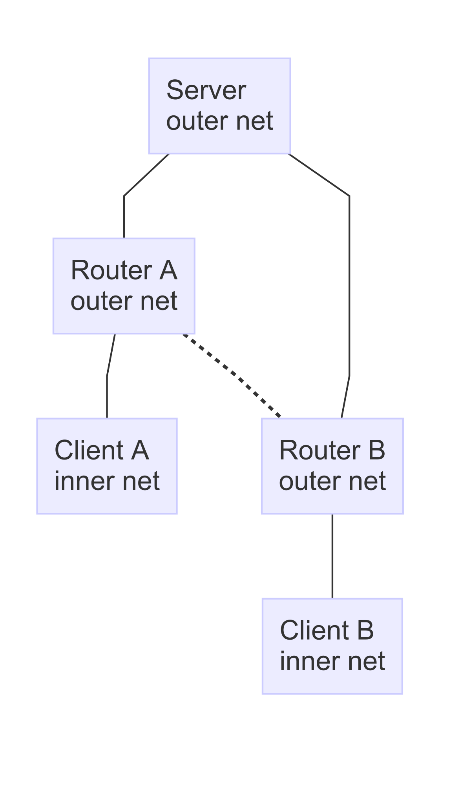
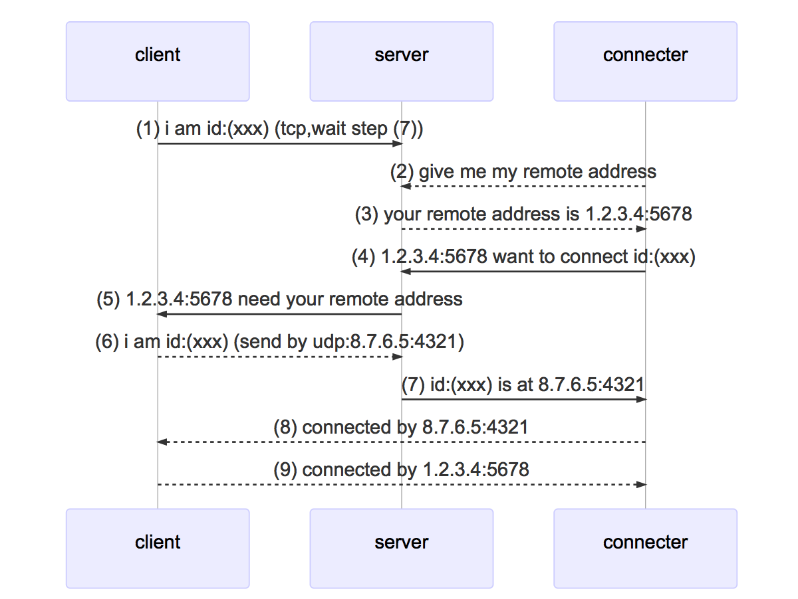

# expose your port to other
the diffrence from other tool is that your data is not flow through the server 

## flow chart


1. Client A send udp to Server through Router A
2. Server get Router A's ip:port that map to Client A
3. tell client B Router A's ip:port
4. client B can send to Client A by Router A's ip:port
5. client A can send to Client B by the same way

## sequence chart
server: outer net  
client: inner net  
connecter: inner net  


## usage

need mongodb

### 1.server
``` 
expose server
```
### 2.client (wait other connect)
```
expose client
```
### 3.connecter 
```
expose connect id:(client id string)
```
### 4.config
``` ini
# expose.ini
MongoUrl = 127.0.0.1

[Server]
RpcAddress     = 0.0.0.0:9182
TcpAddress     = 0.0.0.0:9183
UdpAddress     = 0.0.0.0:9184
AskAddrTimeOut = 30

[ClientServer]
# auto get when first run
Id          = 59a7c165d929ceb31857ffed
ReadTimeOut = 300
# run command and forward stdin and stdout to connecter
Command     = /bin/bash
RpcAddress  = inu1255.cn:9182
TcpAddress  = inu1255.cn:9183
UdpAddress  = inu1255.cn:9184
```
